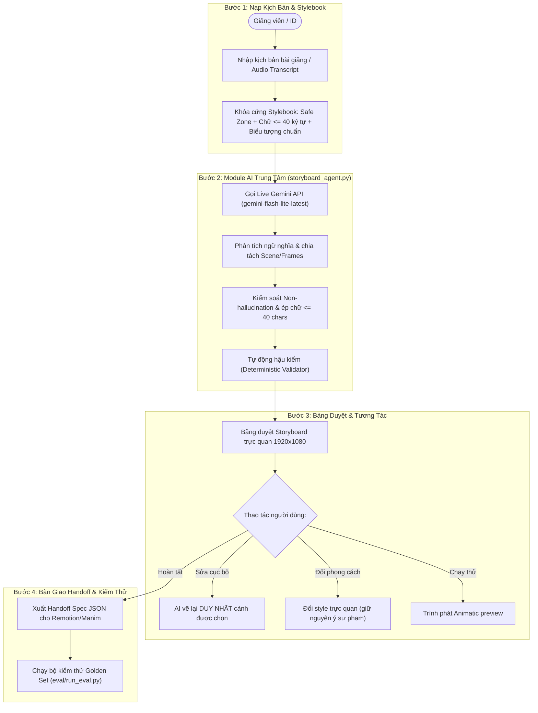

# Tài Liệu Kỹ Thuật & Hướng Dẫn Thực Thi Prototype (CP2 & CP3)

**Người thực hiện:** Phạm Đình Hải (2A202602482)  
**Nhánh:** `hai`  
**Dự án:** Track C · Đề C4: StoryboardAI — Agent dựng kịch bản hình ảnh cho video bài giảng  
**Nhóm:** `K4-3B-E403-BotVN` (Hoàng · Hải · Đại)  

---

## 📌 Nội dung bàn giao trong Pull Request

Thư mục `codebase/` bao gồm nguyên mẫu tương tác và module AI thật phục vụ cho cả **Checkpoint 2 (CP2)** và **Checkpoint 3 (CP3)**:

| File | Vai trò & Mục đích | Trạng thái |
|---|---|:---:|
| `mockup-cp2.html` | Bản mock bấm được 4 bước (Clickable Interactive Prototype) | Hoàn tất CP2 |
| `storyboard_agent.py` | Module trung tâm gọi Live Gemini AI tạo phân cảnh JSON chuẩn Stylebook | Hoàn tất CP3 |
| `app_demo.py` | Script tương tác dòng lệnh phục vụ quay Video 30 giây trực tiếp | Hoàn tất CP3 |

---

## 🤖 1. Module Quyết Định AI Trung Tâm (`storyboard_agent.py`)

Đây là mắt xích cốt lõi của sản phẩm thực thi nhiệm vụ chuyển hóa bài giảng thành kịch bản phân cảnh:
- **Mô hình AI:** Tích hợp trực tiếp Google Gemini API (`gemini-flash-lite-latest`) với độ trễ thấp (~1.8s) và tính tuân thủ cao.
- **Ràng buộc Stylebook tự động (System Prompt):**
  1. `on_screen_text` $\le 40$ ký tự (ngăn ngừa quá tải nhận thức học viên).
  2. Vùng hiển thị an toàn `safe_zone`: $X \in [80, 1840], Y \in [250, 960]$ (chừa khoảng trống cho HUD và phụ đề).
  3. Chống ảo giác (Non-hallucination): Cấm bịa đặt số liệu/tỷ lệ phần trăm khi kịch bản gốc chỉ có tính định tính.
  4. Quy chuẩn biểu tượng trực quan: Chuẩn hóa ký hiệu Database, Server rack, Cache chip, Kafka Queue.
- **Tự động hậu kiểm (Deterministic Verification):** Hàm `validate_storyboard` thực hiện kiểm toán nghiêm ngặt từng frame trước khi xuất dữ liệu.

### Cách chạy thử nhanh module AI:
```powershell
python codebase/storyboard_agent.py
```

---

## 🎬 2. Giao Diện Tương Tác Quay Video 30s (`app_demo.py`)

Cung cấp công cụ chạy demo trực quan phục vụ yêu cầu quay video 30 giây cho CP3:
- Cho phép chọn 3 kịch bản mẫu điển hình (Caching, Con trỏ RAM, Microservices) hoặc tự nhập kịch bản mới.
- Hiển thị trực quan quá trình gửi và nhận dữ liệu từ AI.
- In kết quả từng Frame (Chữ hiển thị, Biểu tượng, Tọa độ Safe Zone) và bảng nghiệm thu Stylebook.

### Cách chạy demo:
```powershell
python codebase/app_demo.py
```

---

## 🎨 3. Bản Mock Bấm Được (`mockup-cp2.html`)

Bản prototype tương tác độc lập (chạy offline trên trình duyệt):
* **Cách mở:** Nhấp đúp chuột vào file `mockup-cp2.html` hoặc chuột phải chọn *Open with Chrome / Edge*.
* **4 bước trải nghiệm hoàn chỉnh:**
  1. **Bước 1 — Nạp kịch bản & Sổ quy ước (Stylebook):** Nạp transcript, khóa cứng quy chuẩn Safe Zone và giới hạn ký tự.
  2. **Bước 2 — Bảng duyệt Storyboard:** Khung hình 1920×1080 @ 30fps, lưới Safe Zone bật/tắt, sửa cục bộ từng cảnh (*Granular Edit*), đổi style giữ nguyên ý.
  3. **Bước 3 — Trình phát Animatic xem thử:** Xem trước chuyển động và nhịp đọc audio.
  4. **Bước 4 — Bàn giao thông số kỹ thuật (Handoff Spec):** Xuất file JSON chuẩn cho Remotion/Manim và nhật ký kiểm định quy chuẩn.

---

## 🗺️ Sơ đồ luồng hoạt động tổng thể


