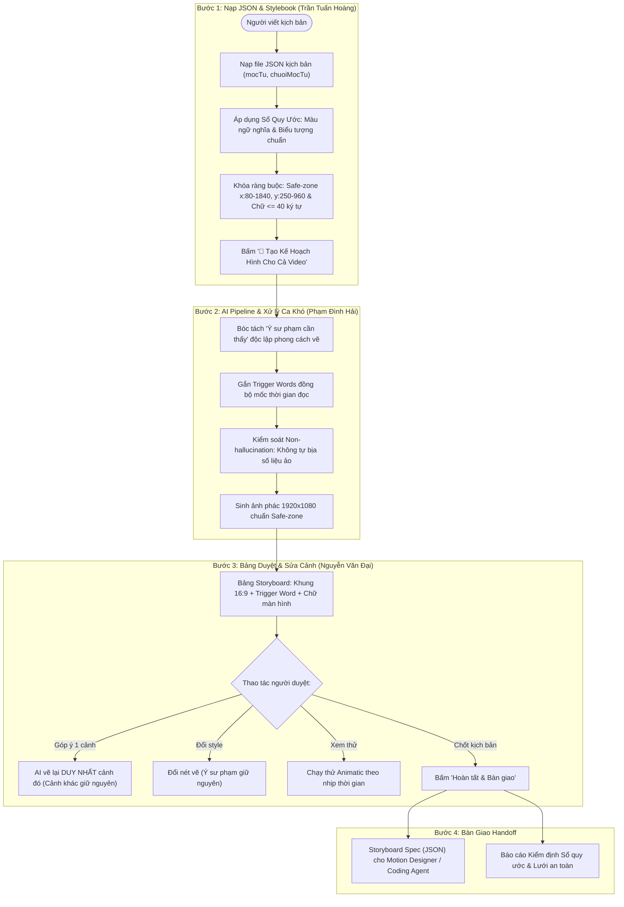

# Kế Hoạch Hình Ảnh & Bản Mock Bấm Được (Deliverable CP2)

**Người thực hiện:** Phạm Đình Hải (2A202602482)  
**Nhánh:** `hai`  
**Dự án:** Track C · Đề C4: StoryboardAI — Agent dựng kịch bản hình ảnh cho video bài giảng  
**Nhóm:** `K4-3B-E403-BotVN` (Hoàng · Hải · Đại)

---

## 📌 Nội dung bàn giao trong Pull Request

### 1. File Prototype: `mockup-cp2.html`
Bản mock bấm được tương tác hoàn chỉnh (Clickable Prototype) đáp ứng 100% tiêu chí của **Checkpoint 2 (CP2)** theo yêu cầu của BTC Hackathon.

* **Cách mở:** Nhấp đúp chuột vào file `mockup-cp2.html` hoặc chuột phải chọn *Open with Chrome / Edge*. Không cần cài đặt thêm thư viện (chạy offline độc lập).
* **Các tính năng đã hoàn thiện:**
  1. **Bước 1 — Nạp kịch bản & Sổ quy ước (Stylebook):**
     * Hỗ trợ dữ liệu JSON `loi-doc-d1-2.json` có mốc thời gian từng từ (`mocTu`, `chuoiMocTu`).
     * Khóa cứng Sổ quy ước: Bảng màu ngữ nghĩa (Semantic Palette), Thư viện ký hiệu (Database hình trụ 3 tầng, Server đèn LED), và nguyên tắc không bịa số liệu ảo.
  2. **Bước 2 — Bảng duyệt Storyboard (Visual Board):**
     * Khung hình chuẩn 1920×1080 @ 30fps.
     * **Lưới Vùng An Toàn (Safe Zone):** Chuẩn xác tọa độ nhóm quy định ($x \in [80, 1840]$, $y \in [250, 960]$), chừa dải trên cho HUD và dải đáy cho phụ đề. Có công tắc bật/tắt trực quan.
     * **Cụm từ kích hoạt (Trigger Words):** Được highlight vàng cam nổi bật kèm mốc thời gian.
     * **Tự soát chữ màn hình:** Bộ đếm ký tự thời gian thực báo xanh khi $\le 40$ ký tự, báo đỏ khi vượt quá.
     * **Sửa cục bộ 1 cảnh (Granular Edit):** Bấm *✏ Góp ý cảnh này* ở Cảnh 02 $\rightarrow$ Chỉ riêng Cảnh 02 phát sáng và cập nhật sang hình đám mây/khiên, các cảnh khác giữ nguyên 100% (bảo toàn ngữ cảnh).
     * **Đổi phong cách giữ nguyên ý:** Chuyển đổi giữa *Tech Blueprint*, *Hand-drawn Chalkboard* (Bảng phấn), và *Minimal 2D* mà không làm mất ý sư phạm.
  3. **Bước 3 — Trình phát Animatic xem thử:**
     * Chạy thử mô phỏng video player theo dòng thời gian, đồng bộ nhịp đọc và phụ đề ở đáy trước khi tốn chi phí dựng video.
  4. **Bước 4 — Bàn giao thông số kỹ thuật (Handoff Spec):**
     * Xuất file Storyboard Spec JSON chuẩn chỉnh cho Motion Designer / Coding Agent (Remotion/Manim).
     * Xuất Báo cáo kiểm định Sổ quy ước (Audit Log) minh chứng không vi phạm quy chuẩn BTC.

---

## 🗺️ Sơ đồ luồng hoạt động (Dành cho Slide / Form nộp CP2)

