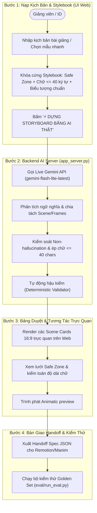

# Tài Liệu Kỹ Thuật & Hướng Dẫn Thực Thi Prototype (CP2 & CP3)

**Người thực hiện:** Phạm Đình Hải (2A202602482)  
**Nhánh:** `hai`  
**Dự án:** Track C · Đề C4: StoryboardAI — Agent dựng kịch bản hình ảnh cho video bài giảng  
**Nhóm:** `K4-3B-E403-BotVN` (Hoàng · Hải · Đại)  

---

## 📌 Nội dung bàn giao trong Pull Request

Thư mục `codebase/` bao gồm nguyên mẫu tương tác và module AI thật phục vụ cho cả **Checkpoint 2 (CP2)** và **Checkpoint 3 (CP3)**:

| File | Vai trò & Mục đích | Trạng thái |
|---|---|:---:|
| `index.html` | **Giao diện Web App tương tác hoàn chỉnh kết nối Live AI qua API** | Hoàn tất CP3 (Khuyên dùng) |
| `app_server.py` | Web Server Python nội bộ phục vụ GUI và API Live Gemini Call | Hoàn tất CP3 |
| `storyboard_agent.py` | Module trung tâm gọi Live Gemini AI tạo phân cảnh JSON chuẩn Stylebook | Hoàn tất CP3 |
| `app_demo.py` | Demo dòng lệnh tương tác trực quan (CLI version) | Hoàn tất CP3 |
| `mockup-cp2.html` | Bản mock bấm được 4 bước độc lập ban đầu | Hoàn tất CP2 |

---

## 🚀 1. Khởi Chạy Giao Diện Hoàn Chỉnh (Graphical Web App GUI)

Đây là giao diện đồ họa hoàn chỉnh kết nối trực tiếp với mô hình AI thật (`gemini-flash-lite-latest`):
- **Khởi chạy 1-Click:** Nhấp đúp chuột vào file **`run_demo.bat`** tại thư mục gốc dự án.
- **Hoặc khởi chạy bằng lệnh:**
  ```powershell
  python codebase/app_server.py
  ```
  Hệ thống sẽ tự động bật trình duyệt web tại `http://localhost:8501`.

### 4 Bước Thao Tác Trực Quan Trên Giao Diện:
1. **Bước 1 — Nạp Kịch Bản & Chọn Mẫu:**
   - Chọn nhanh các kịch bản thực tế: Caching & DB, Con trỏ RAM C++, Kafka Queue, Sóng hấp dẫn hoặc tự do dán bài giảng mới.
   - Bấm nút: **`⚡ DỰNG STORYBOARD BẰNG AI THẬT (LIVE GEMINI CALL)`**.
   - Hộp thoại xoay spinner trong ~1.8 giây phân tích ngữ nghĩa, chia cảnh, áp dụng Stylebook.
2. **Bước 2 — Bảng Duyệt Storyboard Trực Quan:**
   - Hiển thị các Scene Cards 16:9 sinh ra từ AI thật.
   - Minh họa đồ họa SVG tự động thích ứng với biểu tượng (Database cylinder, Server rack, Cache chip).
   - Bật/Tắt Lưới Vùng An Toàn (`x:80-1840, y:250-960`).
   - Tự động soát ký tự chữ hiển thị `on_screen_text` $\le 40$ ký tự.
3. **Bước 3 — Xem Thử Animatic:**
   - Trình phát video giả lập chuyển động nhịp thời gian, chữ màn hình và phụ đề đáy.
4. **Bước 4 — Bàn Giao Kỹ Thuật (Handoff):**
   - Xuất JSON Handoff Spec và Báo cáo Kiểm định Sổ quy ước (Audit Log).

---

## 🤖 2. Module Quyết Định AI Trung Tâm (`storyboard_agent.py`)

Mắt xích cốt lõi của sản phẩm thực thi nhiệm vụ chuyển hóa bài giảng thành kịch bản phân cảnh:
- **Mô hình AI:** Tích hợp trực tiếp Google Gemini API (`gemini-flash-lite-latest`) với độ trễ thấp (~1.8s) và tính tuân thủ cao.
- **Ràng buộc Stylebook tự động (System Prompt):**
  1. `on_screen_text` $\le 40$ ký tự (ngăn ngừa quá tải nhận thức học viên).
  2. Vùng hiển thị an toàn `safe_zone`: $X \in [80, 1840], Y \in [250, 960]$ (chừa khoảng trống cho HUD và phụ đề).
  3. Chống ảo giác (Non-hallucination): Cấm bịa đặt số liệu/tỷ lệ phần trăm khi kịch bản gốc chỉ có tính định tính.
  4. Quy chuẩn biểu tượng trực quan: Chuẩn hóa ký hiệu Database, Server rack, Cache chip, Kafka Queue.
- **Tự động hậu kiểm (Deterministic Verification):** Hàm `validate_storyboard` thực hiện kiểm toán nghiêm ngặt từng frame trước khi xuất dữ liệu.

---

## 🗺️ Sơ đồ luồng hoạt động tổng thể


